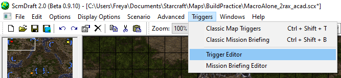
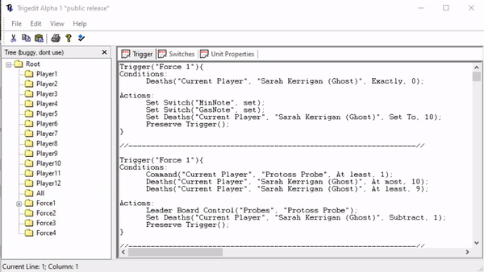

# Macro practice for starcraft

Generate builds at [freyasspirit.github.io](https://freyasspirit.github.io/)

Pregenerated builds are available [here](https://drive.google.com/drive/folders/1GzVsLiUY5JM5Dgvd-SdSXE9Jix8juDpw?usp=sharing)

Requirements:

* [ScmDraft 2](http://www.stormcoast-fortress.net/cntt/software/scmdraft/download/), the StarCraft map editor
* [JSON Parser](http://json.parser.online.fr/), a web based parser for debugging input errors
* [Macro Alone](https://drive.google.com/drive/folders/1GzVsLiUY5JM5Dgvd-SdSXE9Jix8juDpw?usp=sharing), the base map for macro practice.
  All builds orders will be added to this map for practice.

Instructions for use:

1. Create a JSON file for the new build you want to use.  A sample input file exists at [freyasspirit.github.io](https://freyasspirit.github.io/)
1. Click "Generate Triggers" and copy the output
1. Open [Macro Alone](https://drive.google.com/drive/folders/1GzVsLiUY5JM5Dgvd-SdSXE9Jix8juDpw?usp=sharing) in 
  [ScmDraft 2](http://www.stormcoast-fortress.net/cntt/software/scmdraft/download/), the StarCraft map editor
1. Triggers -> Trigger Editor 
1. Paste the triggers generated earlier.  It doesn't matter if they are pasted at the top or bottom of the existing triggers.
1. Click compile.  This is the checkbox with a blue diamond next to it 
1. Click "Save As" and choose a filename which represents the build order to practice
1. Optional: Send the newly generated map to FreyasSpirit#8784 on discord so it can be added into list of pregenerated maps
